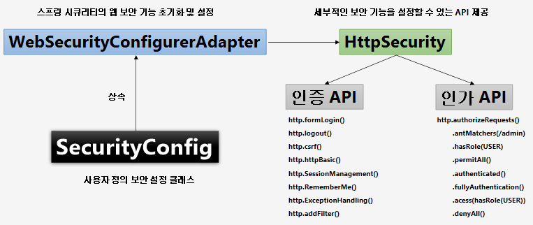
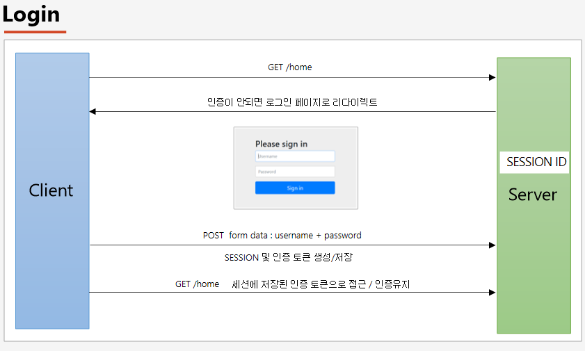
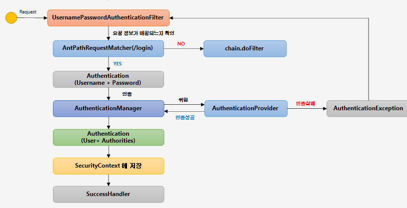
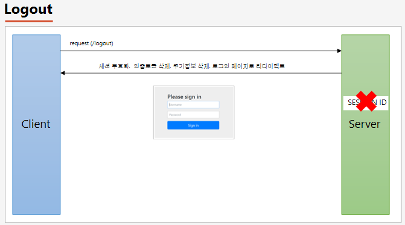
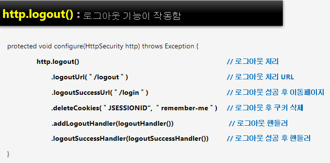
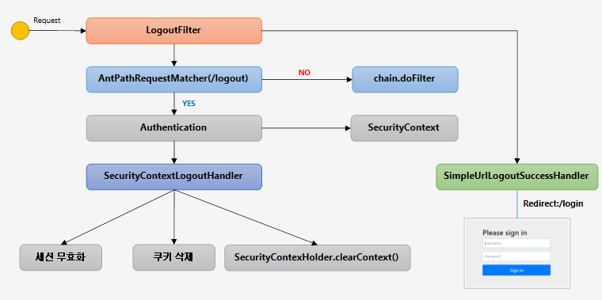
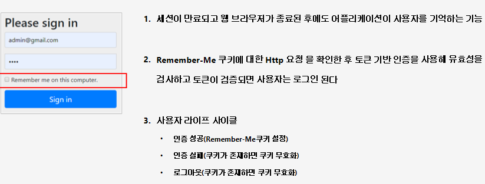
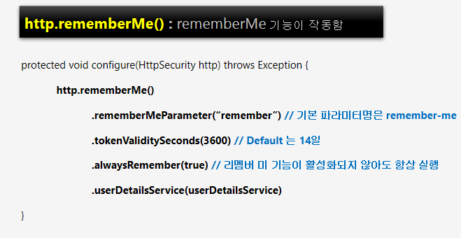
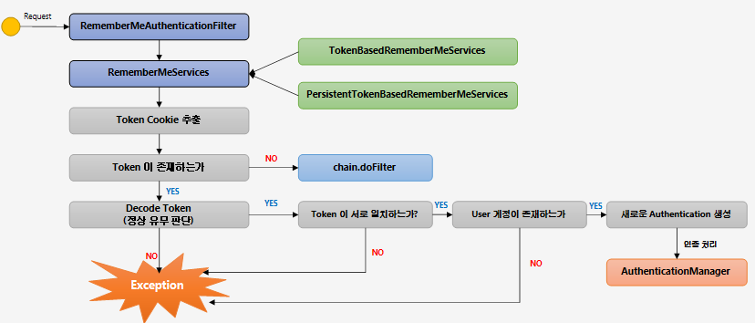

# 스프링 부트 기반 스프링 시큐리티 - 인프런 정수원님 강의 정리


# 스프링 부트 기반 스프링 시큐리티 프로젝트

## 개발환경

* Spring Boot
* JDK 8
* Postgresql
* maven
*
## 선수지식
* Spring Data JPA
* Thymeleaf
* Spring MVC
* Spring Security

## 시큐리티 의존성 추가
```maven
<dependency>
    <groupId>org.springframework.boot</groupId>
    <artifactId>spring-boot-starter-security</artifactId>
</dependency>
```

### 스프링 시큐리티의 의존성 추가 시 일어나는 일들
* 서버가 기동되면 스프링 시큐리티의 초기화 작업 및 보안 설정이 이루어진다
* 별도의 설정이나 구현을 하지 않아도 기본적인 웹 보안 기능이 현재 시스템에 연동되어 작동함
    1. 모든 요청은 인증이 되어야 자원에 접근이 가능하다
    2. 인증 방식은 `폼 로그인` 방식과 `httpBasic 로그인` 방식을 제공한다
    3. 기본 로그인 페이지 제공한다 (/login)
    4. 기본 계정 한 개 제공한다 – username : user / password : 랜덤 문자열


> Using generated security password: __40f5bd88-a7f3-4d6f-916d-bfd7f142b9f8__

스프링 시큐리티가 기본적으로 제공하는 `계정`의 패스워드. 로그인 할 때 사용

> ID: __user__  
> password __40f5bd88-a7f3-4d6f-916d-bfd7f142b9f8__
>

`http://localhost:8080/login` 로 접속시 다음과 같이 사용


<br>
<br>

## 사용자 정의 보안 기능 구현
-------



서버가 기동되면 스프링 시큐리티가 초기화 되고 웹 보안 기능 작동


* ### WebSecurityConfigurerAdapter : 시큐리티의 웹 보안 기능 초기화 및 설정
* ### HttpSecurity : 세부적인 보안 기능을 설정할 수 있는 API

사용자 정의 보안 설정 클래스는 `WebSecurityConfigurerAdapter`를 `상속`받아 사용

```java
@Configuration
@EnableWebSecurity
public class SecurityConfig extends WebSecurityConfigurerAdapter {

@Override
protected void configure(HttpSecurity http) throws Exception { 
	http
		.authorizeRequests()			
		.anyRequest().authenticated()		
	.and()
		.formLogin(); 			
}

```

## HTTPSecurity 클래스

### 인증 API
* http.formLogin() : form 태그 기반의 로그인을 지원하겠다는 설정
* http.logout() : logout 관련 설정
* http.csrf() : csrf(Cross site request forgery) 관련 설정
* http.httpBasic() : 사용자가 Http기반 인증으로 인증
* http.SessionManagement() : 동시 로그인 관련 설정
* http.RememberMe() : 로그인한 사용자만 접근할 수 있다. 리멤버기능
* http.ExceptionHandling() : 익셉션 관련 설정
* http.addFilter() : 필터 관련 설정
* anonymous() : 인증되지 않은 사용자도 접근할 수 있다.
### 인가 API

* http.authorizeRequests()  : 요청에 대한 권한을 지정할 수 있다.  
  .antMatchers(/admin) : 경로가 /admin인 요청은 인증되어야 함을 명시  
  .hasRole(USER)  
  .permitAll()  
  .authenticated()  
  .fullyAuthentication()  
  .acess(hasRole(USER))  
  .denyAll()

스프링 시큐리티 의존성을 설정하고 나면  
WebSecurityConfigurerAdapter 클래스의 `getHttp()`메서드에 진입  
`applyDefaultConfiguration` 메소드를 호출하여   
HttpSecurity 클래스의 11개의 세부적인 보안기능을 초기화 한다.
(csrf(), addFilter(), exceptionHandling(), headers(), sessionManagement() 등 )

* ## WebSecurityConfigurerAdapter클래스의 configure() 메서드

WebSecurityConfigurerAdapter클래스의 configure 메서드가  
`스프링 시큐리티의 웹 보안 기능 초기화 및 설정 하는 기능을 한다. `  
이 메서드를 상속 받아서 `configure(HttpSecurity http) `메서드를 재정의 하여  
자신만의 기능을 구현한다

### application.properties 파일을 이용하여 시큐리티 기본 로그인 ID/PW 설정

* ### application.properties

    ```
    spring.security.user.name=user
    spring.security.user.password=password1234
    ```

<br>

## 인증 API - Form 인증
---



* ### http.formLogin()
```
protected void configure(HttpSecurity http) throws Exception {
	 http.formLogin()
            .loginPage(“/login.html")   			// 사용자 정의 로그인 페이지
            .defaultSuccessUrl("/home)				// 로그인 성공 후 이동 페이지
	        .failureUrl(＂/login.html?error=true“)	// 로그인 실패 후 이동 페이지
            .usernameParameter("username")			// 아이디 파라미터명 설정
            .passwordParameter(“password”)			// 패스워드 파라미터명 설정
            .loginProcessingUrl(“/login")			// 로그인 Form Action Url
            .successHandler(loginSuccessHandler())  // 로그인 성공 후 핸들러
            .failureHandler(loginFailureHandler())	// 로그인 실패 후 핸들러
}

```

### ex
```java
@Override
    protected void configure(HttpSecurity http) throws Exception {
        http
                .authorizeRequests()
                .anyRequest().authenticated();

        http
                .formLogin()
                .loginPage("/loginPage") // 로그인 페이지 url
                .defaultSuccessUrl("/") // 로그인 성공시 root로
                .failureUrl("/loginPage") // 로그인 실패시 페이지 url
                .usernameParameter("userId") // 유저 id 파라미터명
                .passwordParameter("passwd") // 유저 패스워드 파라미터명
                .loginProcessingUrl("/login_proc") // 로그인 처리할 url
                .successHandler(new AuthenticationSuccessHandler() { // 인증 성공시 처리할 핸들러
                    @Override
                    public void onAuthenticationSuccess(HttpServletRequest httpServletRequest, HttpServletResponse httpServletResponse, Authentication authentication) throws IOException, ServletException {
                        System.out.println("authentication" + authentication.getName());
                        httpServletResponse.sendRedirect("/");
                    }
                })
                .failureHandler(new AuthenticationFailureHandler() { // 실패시 처리할 핸들러
                    @Override
                    public void onAuthenticationFailure(HttpServletRequest httpServletRequest, HttpServletResponse httpServletResponse, AuthenticationException e) throws IOException, ServletException {
                        System.out.println("exception" + e.getMessage());
                        httpServletResponse.sendRedirect("/loginPage");
                    }
                })
                .permitAll() // loginPage("/loginPage") 설정한 loginPage 는 인증 없이도 접근이 가능 해야 하기 때문.
        ;
    }
```

## 인증 API - Login Form 인증 필터



Form Login 방식에서 사용자가 로그인을 하게되면 인증 처리가 이루어지는데   
그 인증을 처리하는 필터 :  `UsernamePasswordAuthenticationFilter `

* AntPathRequestMatcher 는 요청 URL 정보가 매칭되는지 확인 default url:  /login
    * 변경방법 : loginProcessingUrl("url")

### 인증 처리 방식
1. Authentication 객체를 만들어서 입력한 Username 과 Password 를 저장
    * AuthenticationManager 는 AuthenticationProvider 클래스 타입의  
      객체들을 가지고 있어서 이 중에서 하나를 선택해서 인증 처리를 위임

    * `실제 인증 처리는 AuthenticationProvider 가 처리 `

    * 인증 처리에 실패하면 AuthenticationException 을 통해   
      다시 UsernamePasswordAutenticationFilter 로 이동

2. 인증에 성공하면 user 정보와 Authorities(권한) 정보를 저장하여 다시 AuthenticationManager 에게 리턴

3. AuthenticationManager 는 AuthenticationProvider 에게 받은 최종적인 인증 객체인 Authentication 을 필터에게 전달
4. 필터는 Authentication 을 SecurityContext 에 저장
5. SuccessHandler 를 통해 성공 후 작업을 처리


## 인증 API - Logout
---



로그아웃 요청시
* 세션 무효화
* 인증토큰 삭제
* 쿠키 정보 삭제
* 로그인 페이지로 리다이렉트

### SecurityConfig - configure 메서드


* 기본적으로 post 방식으로 요청해야 한다





##  Remember Me 인증
---



### SecurityConfig - configure 메서드


세션 프로세스
* 클라이언트가 서버에 접속시 세션 ID 를 발급
* 서버에서는 클라이언트로 발급해준 세션 ID 를 쿠키를 사용해 저장 (JSESSIONID)
* 클라이언트는 다시 접속할 때, 이 쿠키(JSESSIONID)를 이용해서 세션 ID 값을 서버에 전달


rememberMe 기능을 체크하고 로그인하면 서버가 remember-me라는 이름의 쿠키 발급

> JSESSIONID 쿠키가 없어져도 remember-me 쿠키가 있으면   
> remember-me 쿠키를  이용하여 해당 value 에 있는 id, pw 를 파싱하여   
> User 정보로 통해서 다시 인증을 시도하고 인증을 성공하게 되면 JSESSIONID가 재발급된다   
> (RememberMeAuthenticationFilter에서 처리)

* remember-me 키에 대한 값 : id, pw, 쿠키 만료일

## RememberMeAuthenticationFilter



RememberMeAuthenticationFilter : 사용자가 인증이 유지된체로 이용할 수 있게 해주는 인증 필터

1. 리멤버미 쿠키를 받아 로그인
2. 리멤버미 서비스가 체크
    * TokenBasedRememberMeServices : 인메모리 방식으로 사용자 인증
    * PersistentTokenBasedRememberMeServices : 디비에 저장된 토큰으로 사용자 인증

3. 리멤버미 서비스가 토큰을 추출
    * 토큰이 존재하지 않으면 다음 필터로 이동(chain.doFilter)
4. 토큰이 존재하면 토큰 형식 규칙을 지키는지 토큰 정상 유무 판단

사용자의 세션이 없고, 인증 객체가 없는 경우 사용자가 전송한 `remember-Me 쿠키`를 사용해서 인증처리를 한다.


remember-me 를 체크하고 로그인하면 AbstractAuthenticationProcessingFilter 에서   rememberMe에 대한 처리를 하고 rememberMe 쿠키를 reponse 에 담는다.  

